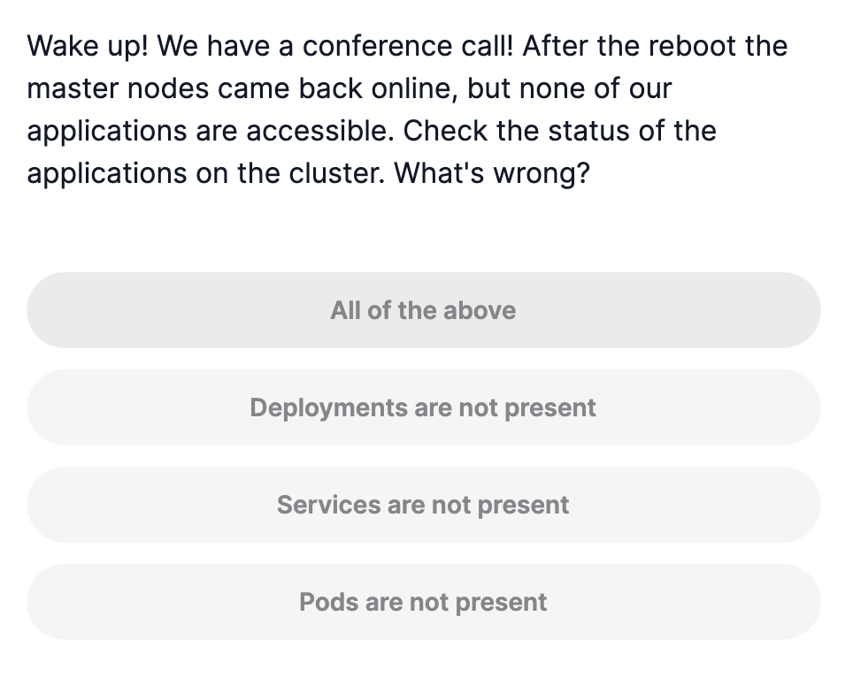

# Cluster Maintenance

## OS Upgrades

### 전제

- 노드가 5분 이상 죽으면 노드 안의 파드를 종료시킴
  - `kube-controller-manager --pod-eviction-timeout=5m0s`
- 해당 파드가 ReplicaSet 의 일부면 다른 노드에 recreate

### 대처

- **노드 드레이닝(Draining)**
  - 업그레이드 전에 노드의 워크로드를 다른 노드로 이동시킴
  - 파드가 정상적으로 종료되고 다른 노드에 재배치됨
  - `kubectl drain <node-name>`
  - `kubectl cordon <node-name>`
    - 해당 노드를 **스케줄 불가능(unschedulable)** 상태로 표시`
  - `kubectl uncordon <node-name>`
    - 노드를 다시 **스케줄 가능(schedulable)** 상태로 만듦
  - ReplicaSet, Job, DaemonSet, StatefulSet의 일부인 파드의 경우 쉽게 삭제 및 재생
- **블루/그린 업그레이드**
  - 새 OS 버전으로 완전히 새로운 노드 세트를 생성
  - 워크로드를 새 노드로 이동한 후 기존 노드 제거

## Kubernetes Software Versions

- v1.11.3
  - v1: Major
  - 11: Minor
  - 3: Patch

## Cluster Upgrade Process

- 클러스터의 구성요소들이 모두 같은 릴리즈를 사용할 필요는 없음
- 나머지 구성요소들은 kube-apiserver보다 더 높은 버전을 사용할 수 없음
- controller-manager, kube-scheduler 는 kube-apiserver보다 마이너 버전이 1씩 낮을 수 있음
- kubelet, kube-proxy는 2까지 낮을 수 있음
- 한번에 1단계의 마이너 버전 업그레이드가 권장됨
- `kubeadm`을 사용하거나 클라우드 프로바이더가 제공하는 업그레이드가 편함
- `kubeadm upgrade plan`

```bash
kubectl drain node-1
apt-get upgrade -y kubeadm=1.12.0-00
apt-get upgrade -y kubelet=1.12.0-00
kubeadm upgrade node config --kubelet-version v1.12.0
systemctl restart kubelet
kubectl uncordon node-1
```

## Demo - Cluster upgrade

[Upgrading kubeadm clusters](https://kubernetes.io/docs/tasks/administer-cluster/kubeadm/kubeadm-upgrade/)

- `kubeadm upgrade plan`

## Backup and Restore Methods

### 백업 대상

- 애플리케이션 구성 파일: deploy, pod, service 등 yaml
- etcd 클러스터: 모든 클러스터 관련 정보가 저장됨

### 백업 방법

- 선언적 접근법
  - 모든 객체 정의 파일을 소스 코드 저장소에 보관
  - 재사용과 공유 용이함
  - 클러스터 손실 시 쉽게 재배포 가능
- Kube API 서버 쿼리
  - `kubectl get all --all-namespaces -o yaml`
  - 모든 리소스 추출 가능

### etcd 백업 (모든 리소스 구성과 상태가 포함됨)

```bash
# etcd 스냅샷 백업
ETCDCTL_API=3 etcdctl snapshot save snapshot.db \
--endpoints=https://127.0.0.1:2379 \
--cacert=/etc/kubernetes/pki/etcd/ca.crt \
--cert=/etc/kubernetes/pki/etcd/server.crt \
--key=/etc/kubernetes/pki/etcd/server.key

# 백업 확인
ETCDCTL_API=3 etcdctl snapshot status snapshot.db
```

**etcd 복원**

```bash
# etcd 복원
ETCDCTL_API=3 etcdctl snapshot restore snapshot.db --data-dir=/var/lib/etcd-backup
```

```yaml
--advertise-client-urls=https://192.168.227.146:2379
**--cert-file=/etc/kubernetes/pki/etcd/server.crt**
--client-cert-auth=true
--data-dir=/var/lib/etcd
--experimental-initial-corrupt-check=true
--experimental-watch-progress-notify-interval=5s
--initial-advertise-peer-urls=https://192.168.227.146:2380
--initial-cluster=controlplane=https://192.168.227.146:2380
--key-file=/etc/kubernetes/pki/etcd/server.key
--listen-client-urls=https://127.0.0.1:2379,[https://192.168.227.146:2379](https://192.168.227.146:2379/)
--listen-metrics-urls=http://127.0.0.1:2381
--listen-peer-urls=https://192.168.227.146:2380
--name=controlplane
--peer-cert-file=/etc/kubernetes/pki/etcd/peer.crt
--peer-client-cert-auth=true
--peer-key-file=/etc/kubernetes/pki/etcd/peer.key
--peer-trusted-ca-file=/etc/kubernetes/pki/etcd/ca.crt
--snapshot-count=10000
**--trusted-ca-file=/etc/kubernetes/pki/etcd/ca.crt**
```

### 끔찍…



### `kubectl config`

```yaml
Available Commands: current-context   Display the current-context
  delete-cluster    Delete the specified cluster from the kubeconfig
  delete-context    Delete the specified context from the kubeconfig
  delete-user       Delete the specified user from the kubeconfig
  get-clusters      Display clusters defined in the kubeconfig
  get-contexts      Describe one or many contexts
  get-users         Display users defined in the kubeconfig
  rename-context    Rename a context from the kubeconfig file
  set               Set an individual value in a kubeconfig file
  set-cluster       Set a cluster entry in kubeconfig
  set-context       Set a context entry in kubeconfig
  set-credentials   Set a user entry in kubeconfig
  unset             Unset an individual value in a kubeconfig file
  use-context       Set the current-context in a kubeconfig file
  view              Display merged kubeconfig settings or a specified kubeconfig file
```

- ETCD
  - Stacked etcd (일체형)
    - etcd가 컨트롤 플레인 노드와 함께 배치
    - 구성이 단순, 설치 간편, kubeadm 기본 설치 방식
  - External extc (분리형)
    - 컨트롤 플레인이 아닌 곳에서 실행
    - 높은 가용성

```yaml
ps -ef | grep -i etcd
~~etcdctl member list~~
ETCDCTL_API=3 etcdctl \
--endpoints=https://127.0.0.1:2379 \
--cacert=/etc/etcd/pki/ca.pem \
--cert=/etc/etcd/pki/pem \
--key=/etc/etcd/pki/etcd-key.pem \
member list
```

### etcd 복원 후

- 새로운 etcd-data 디렉토리 사용자 그룹 변경
- vi `/etc/systemd/system/etcd.service`
- `—dat-dir` 수정

---

### GPT

- 상태 확인

```bash
 클러스터 상태 확인
etcdctl --endpoints=$ENDPOINTS endpoint status

# 클러스터 건강 체크
etcdctl --endpoints=$ENDPOINTS endpoint health

# 멤버 목록 확인
etcdctl --endpoints=$ENDPOINTS member list
```

- 데이터 관리

```bash
# 키 조회
etcdctl --endpoints=$ENDPOINTS get /registry/pods/default/nginx-pod

# 모든 키 조회
etcdctl --endpoints=$ENDPOINTS get / --prefix=true

# 특정 키 삭제
etcdctl --endpoints=$ENDPOINTS del /registry/services/specs/default/kubernetes
```

- 백업 및 복원

```bash
# 스냅샷 백업
etcdctl --endpoints=$ENDPOINTS snapshot save snapshot.db

# 스냅샷 상태 확인
etcdctl snapshot status snapshot.db

# 스냅샷에서 복원
etcdctl snapshot restore snapshot.db --data-dir=/var/lib/etcd-backup
```

- 성능 모니터링

```bash
# DB 크기 확인
etcdctl --endpoints=$ENDPOINTS endpoint status -w table

# 성능 벤치마크
etcdctl --endpoints=$ENDPOINTS check perf
```

- 인증 및 보안

```bash
# 역할 생성
etcdctl --endpoints=$ENDPOINTS role add myRole

# 사용자 생성
etcdctl --endpoints=$ENDPOINTS user add myUser

# 패스워드 설정
etcdctl --endpoints=$ENDPOINTS user passwd myUser

# 역할에 권한 부여
etcdctl --endpoints=$ENDPOINTS role grant-permission myRole readwrite /keyPrefix/ --prefix
```
