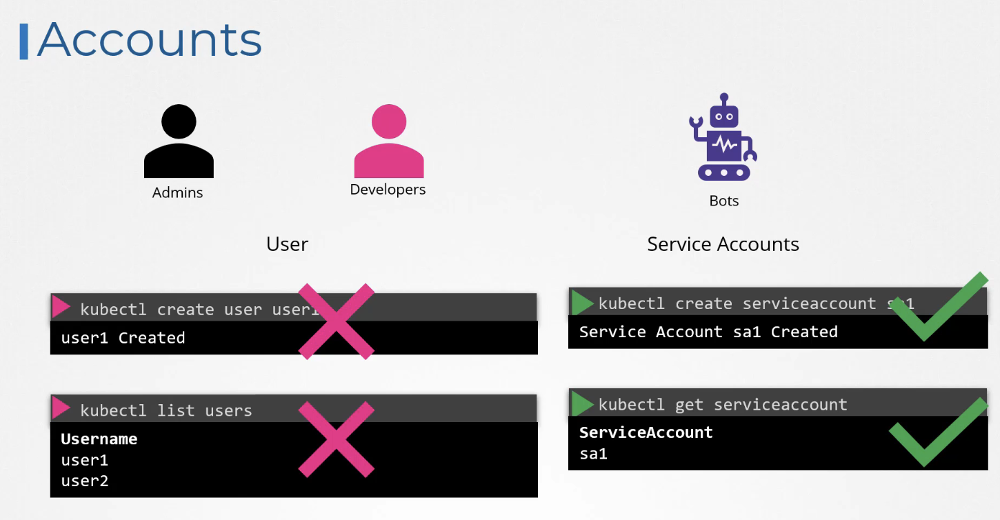

# Security

## Kubernetes Security Primitives

- 호스트 접근 보안
- root 접근 비활성화
- 암호 기반 인증 비활성화, SSH Key 기반 인증만 허용
- API 서버 접근 제어
- 역할 기반 액세스 제어

## Authentication



- 최종 보안은 애플리케이션 레벨 → 제외
- k8s → 직접적으로 사용자 계정 관리 X

- 서드 파티 서비스 등 외부 소스에 의존하여 사용자 관리
- `Service Account`
  - `kubectl create serviceaccount`로 생성


- **서비스 계정 토큰**
  - 파드 내부에서 API 서버와 통신할 때 사용
  - JWT(JSON Web Token) 형식
  - 자동으로 생성되어 파드에 마운트됨
  - `/var/run/secrets/kubernetes.io/serviceaccount/token`에 위치

## kubeconfig 파일

```yaml
apiVersion: v1
kind: Config
clusters:
  - name: my-cluster
    cluster:
      server: https://kubernetes.example.com
      certificate-authority-data: DATA+OMITTED
users:
  - name: my-user
    user:
      client-certificate-data: DATA+OMITTED
      client-key-data: DATA+OMITTED
contexts:
  - name: my-context
    context:
      cluster: my-cluster
      user: my-user
      namespace: default
current-context: my-context
```

## TLS Basics

- 대칭 암호화
- 비대칭 암호화

### TLS

1. 사용자가 HTTPS로 웹 서버 접속시 서버의 공개키 수신
2. 브라우저가 대칭키를 생성하고 서버의 공개키로 암호화하여 전송
3. 서버는 개인키로 메시지 복호화하여 대칭키 확보
4. 이후 통신은 안전하게 확보된 대칭키로 암호화됨

### 인증서, 인증기관

- 발급 대상, 공개키, 서버 위치
- 신뢰할 수 있는 기관 (CA)이 서명해야 브라우저가 신뢰

> 인증서, CA, 서버, 디지털 인증서 생성 및 관리 프로세스 등을 전부 합해 PKI (Public Key Infrastructure)라고 부름.

## TLS in Kubernetes

- 클러스터에 적어도 1개 이상의 인증서를 가져야 함


- 인증서
  - 서버 인증서: 서버에 구성되는 인증서
  - 루트 인증서: CA 서버에 구성되는 인증서
  - 클라이언트 인증서: 클라이언트에 구성되는 인증서
- `.key` 확장자 또는 파일명에 `key` 포함 (ex. server.key, server-key.pem)

## TLS in Kubernetes - Certificate Creation

```yaml
openssl genrsa -out ca.key 2048

openssl req -new -key ca.key -subj “/CN=KUBERNETES-CA” -out ca.csr

openssl x509 -req -in ca.csr -signkey ca.key -out ca.crt

openssl genrsa -out admin.key 2048

openssl req -new -key admin.key -subj \
”/CN=kube-admin” -out admin.csr

openssl x509 -req -in admin.csr -CA ca.crt -CAkey ca.key -out admin.crt
```


## View Certificate Details


→ 인증서 파일 위치 찾기


→ 인증서 세부 정보 확인


- `journalctl`: 리눅스 시스템 로그 조회
- `-u etcd.service`: etcd의 로그만 필터링
- `-l`: 전체 로그 내용을 표시


→ 동일한 내용, `문제 진단`
