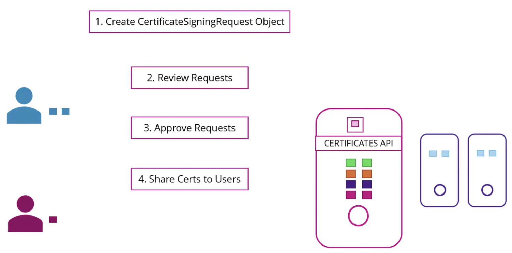

# Seurity-2

## Certificates API

### CA 서버

- CA는 단순히 키와 인증서 파일 쌍
- 이 파일들에 접근 가능한 사람은 쿠버네티스 환경에서 인증서 서명 가능
- 안전한 서버에 보관되어야 함
- kubeadm은 CA 파일을 마스터 노드에 저장함



1. 사용자가 키 생성 및 CSR 생성

   `openssl genrsa -out jane.key 2048`

   `openssl req -new -key jane.key -subj "/CN=jane" -out jane.csr`

2. 관리자가 CSR 객체 생성 (Base64로 인코딩됨)

   

3. `kubectl get csr` 명령으로 요청 확인

   

4. `kubectl certificate approve` 명령으로 요청 승인

   

5. 쿠버네티스가 CA 키 쌍으로 인증서 서명 및 생성
6. 생성된 인증서 추출하여 사용자에게 공유

   

- 모든 인증서 관련 작업은 Controller Manager에 의해 실행
  - CSR-APPROVING
  - CSR-SIGNING
- Controller Manager configuration에 인증서 파일, 키파일 옵션 존재


```yaml
cat <<EOF | kubectl apply -f -
apiVersion: certificates.k8s.io/v1
kind: CertificateSigningRequest
metadata:
  name: myuser
spec:
  request: LS0tLS1CRUdJTiBDRVJUSUZJQ0FURSBSRVFVRVNULS0tLS0KTUlJQ1ZqQ0NBVDRDQVFBd0VURVBNQTBHQTFVRUF3d0dZVzVuWld4aE1JSUJJakFOQmdrcWhraUc5dzBCQVFFRgpBQU9DQVE4QU1JSUJDZ0tDQVFFQTByczhJTHRHdTYxakx2dHhWTTJSVlRWMDNHWlJTWWw0dWluVWo4RElaWjBOCnR2MUZtRVFSd3VoaUZsOFEzcWl0Qm0wMUFSMkNJVXBGd2ZzSjZ4MXF3ckJzVkhZbGlBNVhwRVpZM3ExcGswSDQKM3Z3aGJlK1o2MVNrVHF5SVBYUUwrTWM5T1Nsbm0xb0R2N0NtSkZNMUlMRVI3QTVGZnZKOEdFRjJ6dHBoaUlFMwpub1dtdHNZb3JuT2wzc2lHQ2ZGZzR4Zmd4eW8ybmlneFNVekl1bXNnVm9PM2ttT0x1RVF6cXpkakJ3TFJXbWlECklmMXBMWnoyalVnald4UkhCM1gyWnVVV1d1T09PZnpXM01LaE8ybHEvZi9DdS8wYk83c0x0MCt3U2ZMSU91TFcKcW90blZtRmxMMytqTy82WDNDKzBERHk5aUtwbXJjVDBnWGZLemE1dHJRSURBUUFCb0FBd0RRWUpLb1pJaHZjTgpBUUVMQlFBRGdnRUJBR05WdmVIOGR4ZzNvK21VeVRkbmFjVmQ1N24zSkExdnZEU1JWREkyQTZ1eXN3ZFp1L1BVCkkwZXpZWFV0RVNnSk1IRmQycVVNMjNuNVJsSXJ3R0xuUXFISUh5VStWWHhsdnZsRnpNOVpEWllSTmU3QlJvYXgKQVlEdUI5STZXT3FYbkFvczFqRmxNUG5NbFpqdU5kSGxpT1BjTU1oNndLaTZzZFhpVStHYTJ2RUVLY01jSVUyRgpvU2djUWdMYTk0aEpacGk3ZnNMdm1OQUxoT045UHdNMGM1dVJVejV4T0dGMUtCbWRSeEgvbUNOS2JKYjFRQm1HCkkwYitEUEdaTktXTU0xMzhIQXdoV0tkNjVoVHdYOWl4V3ZHMkh4TG1WQzg0L1BHT0tWQW9FNkpsYWFHdTlQVmkKdjlOSjVaZlZrcXdCd0hKbzZXdk9xVlA3SVFjZmg3d0drWm89Ci0tLS0tRU5EIENFUlRJRklDQVRFIFJFUVVFU1QtLS0tLQo=
  signerName: kubernetes.io/kube-apiserver-client
  expirationSeconds: 86400 # one day
  usages:
  - client auth
EOF
```

`cat akshay.csr | base64 -w 0`

### get {resource} -o yaml 잊지말기

`kubectl get csr agent-smith -o yaml`

## KubeConfig


- 필요성
  - 사용자 인증서와 API 서버 접근을 위한 정보(URL, 인증서 등)를 매번 입력하는 번거로움 해결
  - kubectl 명령어 실행 시 옵션을 반복해서 입력하지 않도록 설정 파일 사용


- 파일 구조
  - clusters
    접근할 다양한 쿠버네티스 클러스터 정보 (개발환경, 테스트환경, 프로덕션 등)
  - users
    클러스터 접근에 사용할 사용자 계정 정보 (admin, dev, prod 등)
  - contexts
    어떤 사용자 계정으로 어떤 클러스터에 접근할지 연결 (예:admin@production)


- `kubectl config view` 현재 설정 보기
- `kubectl config use-context` 컨텍스트 변경


- context에 namespace 추가 가능
- cluster, user에 증명추가 가능
- 인증서 경로는 절대경로로 하는 것 권장
- 인증 데이터 자체를 넣을 수도 있음 (certificate-authority-data 사용)
- `k config use-context {context}`
  - `—kubeconfig` 옵션으로 다른 파일 사용 가능

## API Groups

- API Server: `{Master Node Address}:6443`에서 접근 가능
  - 버전확인 `/version`
  - 파드 목록 `/api/v1/pods`
- Core Group
  - 기본 핵심 기능
  - Namespace, Pod, Controller, Node, PV, PVC, ConfigMap, Secret
- Named Group
  - 주요 그룹:
    - apps: Deployment, ReplicaSet, StatefulSet 등
    - networking: NetworkPolicy 등
    - certificates: CertificateSigningRequest 등
    - storage, authentication, authorization 등
- 각 리소스는 특정 동작 수행 가능
  - list, get, create, delete, update, watch
- API 직접 접근 시 인증서 전달 필요
  - `kubectl proxy` 명령어로 로컬 프록시 사용 가능

## Authorization


1. **Node**
   - kubelet이 API 서버에 접근하기 위한 권한 부여자
   - system 접두사와 system 그룹에 속한 요청 처리
   - kubelet이 필요로 하는 권한만 부여
2. **Attribute-Based Access Control**
   - 사용자나 그룹을 권한 집합과 연결
   - JSON 형식의 정책 파일로 정의
   - 변경 시 파일 수동 편집 및 API 서버 재시작 필요
   - 관리가 어려움
3. **Role-Based Access Control**
   - 권한 집합을 역할로 정의하고 사용자를 역할에 연결
   - 개발자, 보안팀 등 역할별 권한 설정
   - 권한 변경 시 역할만 수정하면 연결된 모든 사용자에 적용
   - 표준적이고 관리하기 쉬운 접근 방식
4. **Webhook**
   - 외부 도구에 권한 부여 위임(ex. Open Policy Agent)
   - 외부 API 호출로 사용자 접근 결정
5. **기타 모드**
   - Always Allow: 모든 요청 허용(기본값)
   - Always Deny: 모든 요청 거부

## Role Based Access Controls


## Cluster Roles and Role Bindings

인증 모드 확인

1. `cat /etc/kubernetes/mainfests/kube-apiserver.yaml`

   `spec:containers:command:kube-apiserver:authorization-mode=Node,RBAC`

2. `kubectl describe pod kube-apiserver-{노드이름} -n kube-system | grep authorization-mode`


- **네임스페이스 범위 리소스**:
  - 특정 네임스페이스 내에 생성됨 (지정하지 않으면 default 네임스페이스)
  - 예: pods, replica sets, deployments, services, secrets, roles, role bindings
  - 관리 시 항상 올바른 네임스페이스 지정 필요
- **클러스터 범위 리소스**:
  - 특정 네임스페이스에 속하지 않음
  - 예: nodes, persistent volumes, cluster roles, cluster role bindings, certificate signing requests, namespaces 자체
  - 생성 시 네임스페이스 지정하지 않음

전체 리소스 목록 확인: `kubectl api-resources --namespaced=true/false`

### 클러스터 역할(ClusterRole)

- 클러스터 범위 리소스에 대한 권한 부여 목적
- 예시
  - 클러스터 관리자에게 노드 보기/생성/삭제 권한 부여
  - 스토리지 관리자에게 persistent volumes 관리 권한 부여
- **정의 파일 작성**:
  - kind: `ClusterRole`
  - 다른 부분은 일반 Role과 유사

### 클러스터 역할 바인딩(ClusterRoleBinding)

- 사용자와 클러스터 역할 연결
- **정의 파일 작성**:
  - kind: `ClusterRoleBinding`
  - subjects: 사용자 정보
  - roleRef: 클러스터 역할 정보

## Service Accounts


- 용도:
  - 애플리케이션이 쿠버네티스 API와 상호작용할 때 사용
  - 예: Prometheus(모니터링), Jenkins(배포 도구) 등
- 서비스 계정 생성 시 자동으로 토큰 생성 및 시크릿 객체에 저장

### 서비스 계정 사용

- 외부 애플리케이션: API 호출 시 베어러 토큰으로 인증
- 쿠버네티스 내부 애플리케이션: 토큰이 자동으로 볼륨 마운트됨

### 기본 서비스 계정(default)

- 모든 네임스페이스마다 자동 생성되는 기본 서비스 계정
- 파드 생성 시 기본 서비스 계정과 토큰이 자동 마운트됨
- 위치: `/var/run/secrets/kubernetes.io/serviceaccount`
- 기본 서비스 계정은 제한된 권한만 가짐

### 사용자 지정 서비스 계정 사용

- 파드 정의에 `serviceAccount` 필드 추가
- 기존 파드는 수정 불가 (삭제 후 재생성 필요)
- 디플로이먼트의 경우 수정 가능 (자동 롤아웃)
- 자동 마운트 방지: `automountServiceAccountToken: false`

### 버전별 변경사항

- **1.22 이전**:
  - 서비스 계정 생성 시 만료 없는 토큰 생성
  - 시크릿으로 파드에 마운트
- **1.22 변경사항**:
  - Token Request API 도입
  - 파드 생성 시 만료 기간이 있는 토큰 생성
  - 프로젝티드 볼륨으로 마운트
- **1.24 변경사항**:
  - 서비스 계정 생성 시 자동 시크릿/토큰 생성 중단
  - 수동 토큰 발급: `kubectl create token [서비스계정명]`
  - 발급된 토큰은 기본 1시간 유효
- 기존 방식(만료 없는 토큰) 사용 시 특수 시크릿 객체 생성 필요
- 보안상 Token Request API 사용 권장 (시간 제한, 대상 제한)

## Image Security

- 기본명명 규칙: `[사용자/계정명]/[이미지명]`
- Pod 정의 중 `imagePullSecrets` 로 시크릿 적용

```yaml
kubectl create secret docker-registry regcred \
--docker-server=<레지스트리-서버> \
--docker-username=<사용자명> \
--docker-password=<비밀번호> \
--docker-email=<이메일>
```

```yaml
apiVersion: v1
kind: Pod
metadata:
  name: private-app
spec:
  containers:
    - name: private-app
      image: <프라이빗-레지스트리-경로>/app:tag
  imagePullSecrets:
    - name: regcred
```

## Pre-requisite - Security in Docker


### 도커와 호스트의 관계

- 컨테이너는 가상 머신과 달리 호스트와 완전히 격리되지 않음
- 컨테이너와 호스트는 동일한 커널을 공유함
- 컨테이너는 리눅스의 네임스페이스를 사용해 격리됨

### 프로세스 격리

- 컨테이너 내부에서는 자신의 프로세스만 볼 수 있음
- 컨테이너 내에서 실행되는 프로세스는 호스트에서도 실행됨
- 호스트에서는 모든 프로세스(자신과 컨테이너의)를 볼 수 있음
- 동일한 프로세스가 다른 네임스페이스에서 다른 PID를 가질 수 있음

### 사용자 관련 보안

- 기본적으로 도커는 컨테이너 내 프로세스를 root 사용자로 실행
- `-user` 옵션으로 다른 사용자 ID 지정 가능
  - 예: `docker run --user 1000 ubuntu sleep 1h`
- Dockerfile의 `USER` 명령어로 이미지 생성 시 기본 사용자 지정 가능

### 루트 사용자 권한 제한

- 컨테이너 내 root 사용자는 호스트의 root 사용자와 다름
- 도커는 리눅스 capabilities를 사용해 권한을 제한함
- 기본적으로 도커는 제한된 capabilities 집합으로 컨테이너 실행

### Capabilities 관리

- `-cap-add`: 특정 권한 추가
- `-cap-drop`: 특정 권한 제거
- `-privileged`: 모든 권한 부여 (위험할 수 있음)

## Security Contexts

- 도커 컨테이너에서 설정할 수 있는 보안 표준들이 쿠버네티스에서도 구성 가능
  - 사용자 ID, 리눅스 capabilities 등을 설정할 수 있음
  - `spec:securityContext:runAsUser`
- 구성 레벨
  - 파드 레벨: 파드 내 모든 컨테이너에 적용
    ```yaml
    apiVersion: v1
    kind: Pod
    metadata:
      name: security-pod
    spec:
      securityContext:
        runAsUser: 1000
      containers:
        - name: ubuntu
          image: ubuntu
          command: ["sleep", "3600"]
    ```
  - 컨테이너 레벨: 특정 컨테이너에만 적용
    ```yaml
    apiVersion: v1
    kind: Pod
    metadata:
      name: security-pod
    spec:
      containers:
        - name: ubuntu
          image: ubuntu
          command: ["sleep", "3600"]
          securityContext:
            runAsUser: 1000
    ```
  - 둘 다 설정된 경우, 컨테이너 레벨 설정이 파드 레벨 설정을 덮어씀
- 컨테이너 유저 파악: `k exec ubuntu-sleeper — whoami`

## Network Policy

- 트래픽 유형
  - Ingress: 대상으로 들어오는 트래픽
  - Egress: 대상에서 나가는 트래픽
  - 응답 트래픽은 방향 결정에 포함되지 않음
- 모든 파드는 기본적으로 서로 통신 가능 (all-allow 규칙)
- 클러스터 내 모든 파드는 가상 프라이빗 네트워크로 연결됨
- 파드 IP, 이름 또는 서비스를 통해 접근 가능

### k8s의 NetworkPolicy란

- 특정 파드 간 트래픽을 제한하기 위한 쿠버네티스 객체
- 레이블과 셀렉터를 사용해 파드에 연결
- 정책에 명시된 규칙과 일치하는 트래픽만 허용

```yaml
apiVersion: networking.k8s.io/v1
kind: NetworkPolicy
metadata:
  name: db-policy
spec:
  podSelector:
    matchLabels:
      role: db
  policyTypes:
    - Ingress
  ingress:
    - from:
        - podSelector:
            matchLabels:
              role: api
      ports:
        - protocol: TCP
          port: 3306
```

## Developing network policies

- 선택자 유형
  - podSelector: 레이블로 파드 선택
  - namespaceSelector: 레이블로 네임스페이스 선택
  - ipBlock: IP 주소 범위로 선택

1.  네트워크 정책을 만들고 DB Pod와 연결

    ```yaml
    podSelector:
      matchLabels:
        role: db
    ```

2.  Ingress 규칙 추가: API 파드에서 데이터베이스로의 연결 허용

    ```yaml
    ingress:
      - from:
          - podSelector:
              matchLabels:
                role: api
        ports:
          - protocol: TCP
            port: 3306
    ```

3.  특정 nameSpace의 API 파드만 접근 허용

    ```yaml
    ingress:
      - from:
          - podSelector:
              matchLabels:
                role: api
            namespaceSelector:
              matchLabels:
                env: prod
    ```

4.  외부 접근 허용: 클러스터 외부 백업 서버의 접근 허용

    ```yaml
    ingress:
      - from:
          - ipBlock:
              cidr: 192.168.5.10/32
    ```

5.  Egress 규칙 추가: DB에서 외부 백업 서버로의 접근 허용

    ```yaml
    egress:
      - to:
          - ipBlock:
              cidr: 192.168.5.10/32
        ports:
          - protocol: TCP
            port: 80
    ```

## Kubectx and Kubens – Command line Utilities

- kubectx
  kubectl config 대신 컨텍스트 전환에 유용한 툴
- kubens
  네임스페이스 전환 툴

## Custorm Resource Definition (CRD)

- CustomResourceDefinition 생성 방법 구성 요소:
  - apiVersion: apiextensions.k8s.io/v1
  - kind: CustomResourceDefinition
  - metadata, spec 섹션으로 구성
  - scope: 네임스페이스 범위 여부 지정(Namespaced 또는 Cluster)
  - group: API 그룹 정의(예: flights.com)
  - names: 리소스 이름 형식 정의(kind, singular, plural, shortnames)
  - versions: 리소스 버전 관리
  - schema: 리소스 스펙에 포함될 필드와 유효성 검사 정의
- Custom Controller
  - CRD는 데이터만 저장할 뿐, 실제 동작은 컨트롤러가 담당
  - 커스텀 컨트롤러는 리소스 생성/삭제 등의 이벤트를 감지하여 필요한 작업 수행
  - 컨트롤러는 Go 언어로 작성되며 쿠버네티스 API 서버와 통신함

## Custom Controllers

- 컨트롤러 개발 방법
  - Python으로 개발 가능하지만 API 호출이 비용이 많이 들고, 자체 큐잉과 캐싱 메커니즘을 만들어야 함
  - Go 언어와 쿠버네티스 Go 클라이언트를 사용하면 shared informers 같은 캐싱과 큐잉 메커니즘을 제공하는 라이브러리를 활용할 수 있음
  1. `sample-controller` GitHub 레포지토리 클론
  2. `controller.go` 파일을 수정해 커스텀 로직 추가
  3. 코드 빌드 및 실행
  4. kubeconfig 파일을 지정해 쿠버네티스 API 인증

## Operator Framework


- 오퍼레이터 프레임워크는 CRD(Custom Resource Definition)와 커스텀 컨트롤러를 단일 엔티티로 패키징함
- 별도로 관리하던 두 구성 요소를 하나로 배포 가능
- 역할
  - CRD와 관련 리소스 자동 생성
  - 커스텀 컨트롤러를 디플로이먼트로 배포
  - 특정 애플리케이션 관리를 자동화 (사람 운영자가 하는 일을 대신함)
- 사용 사례
  - EtcdCluster CRD 생성 및 관리
  - 쿠버네티스 내에서 etcd 배포
  - 백업 및 복원 기능 제공
  - 추가 코드(Backup 및 Restore Operators)로 복잡한 작업 처리
- 오퍼레이터 사용법
  - OperatorHub에서 다양한 오퍼레이터 제공 (etcd, MySQL, Prometheus, Grafana, Argo CD, Istio 등)
  - 설치 과정:
    1. 오퍼레이터 라이프사이클 매니저 설치
    2. 원하는 오퍼레이터 설치
