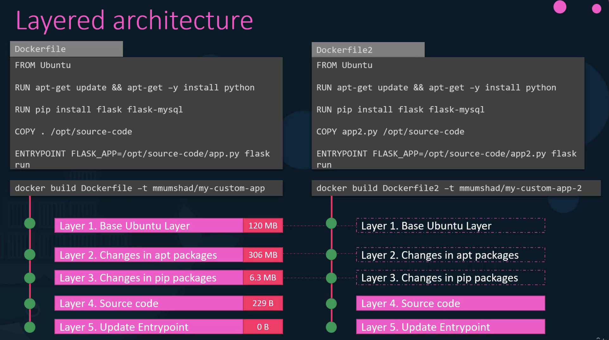

# Storage

## Storage in Docker



- 도커는 기본적으로 `/var/lib/docker/` 경로에 데이터 저장함
- 여러 폴더(AUFS, containers, image, volumes 등)로 구성됨
- 도커 이미지는 **레이어 구조**로 빌드됨
- Dockerfile의 각 명령어가 새로운 레이어를 생성함

### 레이어드 아키텍처의 장점

- 각 레이어는 이전 레이어와의 변경 사항만 저장함
- 비슷한 이미지를 빌드할 때 공통 레이어를 캐시에서 재사용함
- 빠른 이미지 빌드와 디스크 공간 절약 가능
- 애플리케이션 코드 업데이트 시 이전 레이어 재사용해 빠른 재빌드 가능


### 이미지 레이어와 컨테이너 레이어

- 이미지 레이어: 읽기 전용(read-only)
- 컨테이너 레이어: 읽기-쓰기 가능(read-write)
- 컨테이너 레이어는 컨테이너 생명주기 동안만 존재함

### Copy-on-Write 메커니즘

- 이미지 레이어의 파일 수정 시 읽기-쓰기 레이어에 파일 복사본 생성
- 이후 수정은 복사본에서 이루어짐
- 원본 이미지 레이어는 변경되지 않음


### 데이터 지속성 유지 방법

1. Volume mounting
   - `docker volume create` 명령으로 볼륨 생성
   - 볼륨은 `/var/lib/docker/volumes` 디렉토리에 생성됨
   - `docker run -v volume_name:/path/in/container` 형식으로 사용
2. Bind mounting
   - 호스트의 특정 디렉토리를 컨테이너에 마운트
   - `docker run -v /host/path:/container/path` 형식으로 사용

### 새로운 마운트 문법

- `v` 대신 `-mount` 옵션 사용 권장
- `-mount type=bind,source=/host/path,target=/container/path` 형식
- 더 명시적인 키-값 형태로 파라미터 지정

### 스토리지 드라이버

- 레이어드 아키텍처 유지, Copy-on-Write 등 담당
- 종류: AUFS, BTRFS, ZFS, device mapper, overlay, overlay2
- 운영체제에 따라 기본 드라이버가 다름
- 성능과 안정성 특성이 다양하므로 필요에 맞게 선택 가능

## Container Storage Interface (CSI)

- **CRI(Container Runtime Interface)**: 쿠버네티스가 다양한 컨테이너 런타임과 통신하는 표준
- **CNI(Container Networking Interface)**: 네트워킹 솔루션 확장 위한 표준
- **CSI(Container Storage Interface)**: 다양한 스토리지 솔루션 지원 위한 표준
- CSI 특징
  - 자체 스토리지 드라이버 작성 가능
  - Portworx, Amazon EBS, Azure Disk 등 다양한 벤더들이 CSI 드라이버 제공
  - 쿠버네티스만의 표준이 아닌 범용 표준임
  - 현재 쿠버네티스, Cloud Foundry, Mesos가 CSI 채택중
- **CSI 작동 방식**
  - RPC(Remote Procedure Calls) 세트 정의
  - 컨테이너 오케스트레이터가 호출하고 스토리지 드라이버가 구현해야 함
  - 예시:
    - 볼륨 생성시 create volume RPC 호출
    - 볼륨 삭제시 delete volume RPC 호출
  - 파라미터, 응답, 에러코드 등의 사양이 명확히 정의됨

## Volumes


- Docker 컨테이너는 일시적(transient) 특성 가짐
- 컨테이너가 삭제되면 내부 데이터도 함께 소멸됨
- 데이터 유지하려면 볼륨 연결 필요함
- 볼륨에 저장된 데이터는 컨테이너 삭제되어도 유지됨

### Kubernetes의 볼륨

- K8s의 pod도 일시적 특성 가짐
- pod가 삭제되면 처리된 데이터도 소멸됨
- 데이터 유지하려면 볼륨 연결 필요함

### 볼륨 구현 예시

1. 노드에 볼륨 생성 (예: `/data` 디렉토리)
2. pod의 컨테이너에 볼륨 마운트 (예: `/opt` 경로)
3. 컨테이너가 `/opt`에 파일 생성하면 실제론 호스트의 `/data`에 저장됨
4. pod가 삭제돼도 호스트의 `/data`에 데이터 유지됨

### 볼륨 스토리지 옵션

- **`hostPath`**: 단일 노드에선 괜찮지만 다중 노드 클러스터에선 권장하지 않음
  - hostPath는 노드의 로컬 파일시스템을 가리키므로 다른 노드에서 동일 데이터에 접근 불가능함
  - 노드 장애 발생 시 데이터 접근 불가
  - 스케줄링 제약 (nodeSelector, affinity 등 필요해짐)
- **다양한 외부 스토리지 지원**:
  - `NFS`, Ceph FS, Flocker, 등
  - 클라우드 솔루션: AWS EBS, Azure Disk/File, Google Persistent Disk

## Persistent Volumes


- 기존 볼륨의 문제점
  - 일반 볼륨은 파드 정의 파일 내에서 직접 구성해야 함
  - 많은 사용자와 파드가 있는 환경에서는 각 파드마다 스토리지 설정을 반복해야 함
  - 스토리지 변경 시 모든 파드에 수정 작업이 필요함
- 퍼시스턴트 볼륨
  - 관리자가 중앙에서 스토리지 풀을 생성하고 관리할 수 있음
  - 사용자는 퍼시스턴트 볼륨 클레임(PVC)을 통해 필요한 만큼 스토리지 요청 가능
- spec:
  - accessModes: 볼륨 접근 방식 지정(ReadOnlyMany, ReadWriteOnce, ReadWriteMany)
  - capacity: 용량 설정(예: 1GB)
  - 볼륨 타입 선택(hostPath, AWS EBS 등)

## Persistent Volume Claims

- PVC는 쿠버네티스 네임스페이스에서 PV와 별개의 오브젝트
- 관리자가 PV를 생성하고, 사용자는 PVC를 만들어 스토리지 사용 요청
- 쿠버네티스는 요청과 볼륨 속성에 따라 PV와 PVC를 바인딩

### PV-PVC 바인딩 특징

- 하나의 PVC는 단 하나의 PV에만 바인딩
- 바인딩 시 쿠버네티스는 요청된 용량과 접근 모드 등 속성이 맞는 PV 찾음
- 여러 매칭이 가능한 경우 특정 볼륨 지정을 위해 레이블과 셀렉터 사용 가능
- 작은 크기의 PVC도 다른 조건 일치 시 더 큰 PV에 바인딩될 수 있음
- 남은 용량은, 1:1 관계로 인해 다른 PVC가 사용 불가
- 사용 가능한 PV가 없으면 PVC는 대기(pending) 상태로 남아있다가 새 PV 생성 시 자동 바인딩
- spec:
  - accessModes 설정(예: ReadWriteOnce)
  - resources에서 필요한 storage 용량 지정(예: 500MB)

### PVC 삭제 시 PV 처리 정책

1. Retain(기본값): PV 유지, 수동 삭제 필요, 다른 PVC에 재사용 불가
2. Delete: PVC 삭제 시 PV도 자동 삭제, 스토리지 공간 확보
3. Recycle: 데이터 스크럽 후 다른 PVC에 재사용 가능

## Using PVCs in Pods

```yaml
apiVersion: v1
kind: Pod
metadata:
  name: mypod
spec:
  containers:
    - name: myfrontend
      image: nginx
      volumeMounts:
        - mountPath: "/var/www/html"
          name: mypd
  volumes:
    - name: mypd
      persistentVolumeClaim:
        claimName: myclaim
```

## Storage Class


- **정적 프로비저닝(Static Provisioning)**: 이전에는 PV(Persistent Volume)를 수동으로 만들고, PVC(Persistent Volume Claim)로 이를 요청하는 방식이었음
- **동적 프로비저닝(Dynamic Provisioning)**: 스토리지 클래스를 사용하면 애플리케이션이 스토리지를 요청할 때 자동으로 프로비저닝됨


### 스토리지 클래스 작동 방식

- 스토리지 클래스 객체를 생성 (API 버전: `storage.k8.io/v1`)
- 프로비저너 지정 (예: `kubernetes.io/gce-pd` for Google Cloud)
- PVC에서 사용할 스토리지 클래스 이름을 지정하면 됨
- 수동으로 PV를 생성할 필요 없음
- PVC가 생성되면 스토리지 클래스는 자동으로:
  1. 필요한 크기의 디스크를 프로비저닝
  2. PV 생성
  3. PVC를 해당 볼륨에 바인딩

### 서비스 등급


- PVC 생성 시 필요한 스토리지 등급만 지정하면 됨
