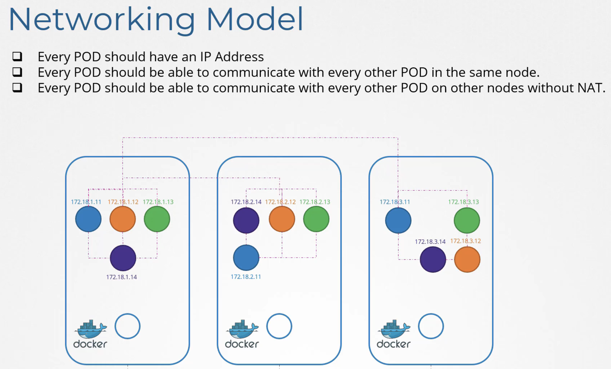

# Networking-2

## Pod Networking

- 쿠버네티스는 Pod 네트워킹 솔루션을 내장하지 않음 → 사용자가 직접 구현해야 함



- 모든 Pod는 고유한 IP 주소를 가져야 함
- 같은 노드 내의 모든 Pod는 IP로 서로 통신 가능해야 함
- 다른 노드의 Pod와도 IP로 통신 가능해야 함


### 네트워킹 솔루션 구현 과정

1. 각 노드에 **브릿지 네트워크** 생성
2. 각 브릿지에 서로 다른 서브넷 할당 (예: 10.244.1.x, 10.244.2.x, 10.244.3.x)
3. 컨테이너 생성될 때마다:
   - 가상 네트워크 케이블(pipe) 생성
   - 한쪽은 컨테이너에, 다른쪽은 브릿지에 연결
   - 컨테이너에 IP 주소 할당
   - 기본 게이트웨이 경로 추가

### CNI 사용하여 네트워크 설정 자동화


- CNI는 k8s와 네트워킹 스크립트 사이의 중개자 역할
- 컨테이너 런타임이 컨테이너 생성 시 CNI 설정을 확인하고 스크립트 실행

### CNI의 자동화 동작 원리

1. Node의 Kubelet이 컨테이너 런타임에게 컨테이너 생성요청
2. 컨테이너가 생성된 후 Kubelet이 CNI 플러그인을 호출

   `/etc/cni/net.d/` 디렉토리에서 CNI 설정 파일 읽고 지정된 플러그인 실행

3. 파드 생성 시 `ADD` 명령어 | 삭제 시 `DEL` | 업데이트 시 `CHECK` 명령어

→ `/opt/cni/bin/calico ADD <컨테이너ID> /proc/<PID>/ns/net`

### veth (Virtual Ethernet)

- **항상 쌍으로 존재**: 한쪽에 들어간 패킷은 항상 반대쪽으로 나옴
- **가상 네트워크 케이블**: 물리적 와이어처럼 동작하는 소프트웨어 구현체
- **네임스페이스 연결**: 서로 다른 네트워크 네임스페이스를 연결하는 데 주로 사용됨

```bash
# veth pair 생성
ip link add veth0 type veth peer name veth1

# 상태 확인
ip link show veth0
ip link show veth1

# 활성화
ip link set veth0 up
ip link set veth1 up
```

### CNI에서의 veth 사용 과정

1. CNI 플러그인이 컨테이너 생성 시 veth pair 생성
2. 한쪽 끝(veth1)은 `컨테이너 네트워크 네임스페이스`에 배치
3. 다른 쪽 끝(veth0)은 `호스트 네트워크 네임스페이스`에 유지
4. 호스트 쪽 veth 인터페이스는 브리지나 기타 네트워크 장치에 연결

### Practice

1. Container Runtime endpoint ?

   `ps -aux | grep -i kubelet`

2. 지정된 플러그인?

   `/etc/cni/net.d/` 에 있는 설정파일 확인

## CNI in kubernetes

- 플러그인 경로: `/opt/cni/bin` (bridge, DHCP, flannel)
- CNI 구성 파일 경로: `/etc/cni/net.d`
- config 옵션
  - isGateway: 브릿지 인터페이스에 IP 주소 할당 여부 (게이트웨이 역할)
  - ipMasq: IP 마스커레이딩용 NAT 규칙 추가 여부
  - IPAM \*\*\*\*(IP Address Management):
    - type: `host-local`(로컬 관리) 또는 `DHCP`(외부 서버) 가능
    - subnet: Pod에 할당할 IP 주소 범위와 필요한 라우트 지정


## CNI weave

- 작은 환경에서는 간단한 라우팅 테이블이 효과적임
  - 대규모 환경(수백 개의 노드, 각 노드에 수백 개의 파드)에서는 실용적이지 않음


- Weave
  - 각 노드에 에이전트/서비스 배포
  - 에이전트들은 서로 통신하며 Node, Network, Pod 정보 교환
  - 노드에 자체 브릿지 생성하고 Weave로 명명
  - 각 네트워크에 IP 주소를 할당

## IP Address Management - Weave


- 컨테이너에 IP할당 하는 것은 CNI 플러그인 책임
- CNI 구성 파일
  - IPAM 섹션에 플러그인 유형, 서브넷, 라우트 지정 가능

## Service Networking

- 서비스 유형
  - ClusterIP: 클러스터 내부에서만 접근 가능한 서비스 (기본 타입)
    - 모든 노드의 파드에서 접근 가능
    - 특정 노드에 바인딩되지 않음
  - NodePort: ClusterIP 기능 + 외부 접근 가능
    - 클러스터의 모든 노드에서 특정 포트를 통해 접근 가능
- 서비스는 가상 객체이고 각 노드에서 실행되는 kube-proxy를 통해 사용됨
- kube-proxy 작동 모드
  - userspace: kube-proxy가 서비스별 포트에서 리스닝하고 파드로 연결 프록시
  - IPVS: IPVS 규칙 생성
  - iptables: 기본 옵션, NAT 테이블에 규칙 추가
- 서비스 IP 범위는 api-server config에서 `serice-cluster-ip-range`로 지정
  - 파드 네트워크 CIDR 범위와 서비스 IP 범위가 겹치면 안 됨

## DNS in kubernetes


- 기본적으로 DNS 서버를 배포함
  - 모든 서비스는 자동으로 DNS 레코드 생성됨
  - 파드 DNS 레코드는 명시적으로 활성화 가능
- 이름 지정 규칙
  1. 같은 네임스페이스: 서비스 이름 만으로 접근 가능 → `web-service`
  2. 다른 네임스페이스: `서비스이름.네임스페이스` → `web-service.apps`
  3. FQDN (Fully Qualified Domain Name) 구조:

     `서비스이름.네임스페이스.svc.cluster.local`
- Pod DNS 레코드 활성화 시
  - IP 주소의 점(.)을 대시(-)로 변환하여 이름 생성
    10.244.1.5 → `10-244-1-5.default.pod.cluster.local`

## CoreDNS in Kubernetes

- 수천 개의 파드를 개별 hosts 파일로 관리하는 것은 비효율적
  → 중앙 DNS 서버 사용
- 쿠버네티스 v1.12 이전: kube-dns 사용
- 쿠버네티스 v1.12 이후: CoreDNS가 권장됨

## CoreDNS 설정


> 분석:
>
> - **`:53`**: CoreDNS가 53번 포트(표준 DNS 포트)에서 DNS 요청을 수신함
> - **`errors`**: 오류 로깅 플러그인으로, 에러 발생 시 로그 기록함
> - **`health`**: 상태 확인 엔드포인트 활성화. 이를 통해 CoreDNS의 상태를 모니터링할 수 있음
> - **`kubernetes`** 섹션:
>   - `cluster.local`, `in-addr.arpa`, `ip6.arpa` 도메인에 대한 쿠버네티스 DNS 조회 처리
>   - `pods insecure`: 파드의 IP 주소 조회를 허용하며, 보안 검증 없이 수행
>   - `upstream`: 로컬에서 해결할 수 없는 DNS 쿼리를 상위 DNS 서버로 전달
>   - `fallthrough`: 지정된 도메인에 대해 쿠버네티스 플러그인이 응답하지 못할 경우 다음 플러그인으로 쿼리 전달
> - **`prometheus :9153`**: 9153 포트에서 Prometheus 메트릭을 노출
> - **`proxy . /etc/resolv.conf`**: 외부 도메인 쿼리를 `/etc/resolv.conf`에 정의된 네임서버로 전달
> - **`cache 30`**: DNS 결과를 30초 동안 캐싱함
> - **`reload`**: 설정 파일이 변경될 때 자동으로 재로딩을 활성화


- kube-system 네임스페이스에 파드로 배포됨 (이중화를 위해 보통 2개의 파드)
- `/etc/coredns/Corefile`에 구성 파일 위치
- 다양한 플러그인으로 구성:
  - 오류 처리, 상태 보고, 메트릭 모니터링, 캐시 등
  - 쿠버네티스 플러그인이 핵심 기능 담당
  - 클러스터 도메인은 기본값으로 `cluster.local` 설정
- DNS 서비스 구성
  - CoreDNS 파드는 ConfigMap으로 구성 관리
  - KubeDNS 서비스로 클러스터 내부에 노출됨
  - 각 파드는 자동으로 DNS 서버 IP를 nameserver로 설정
  - kubelet이 파드 생성 시 DNS 설정을 담당
- 도메인 이름 해석
  - 파드의 `/etc/resolv.conf` 파일에 search 항목 설정됨:
    - `default.svc.cluster.local`
    - `svc.cluster.local`
    - `cluster.local`
    → 서비스는 짧은 이름으로도 접근 가능 (`web-service`)
  - 파드는 전체 FQDN으로만 접근 가능 (search 항목에 pod 도메인이 없음)

## Ingress


- URL 경로 기반 라우팅, SSL 보안 등 구현 가능
- 레이어 7 로드밸런서 역할
- 쿠버네티스 기본 리소스로 정의 파일 관리

### Ingress Controller


- 쿠버네티스에 기본 포함되어 있지 않음 (별도 배포 필요)
- 지원 솔루션: GCE, Nginx, Contour, HAProxy, Traefik, Istio 등
- 주로 GCE와 Nginx가 쿠버네티스 프로젝트에서 공식 지원
- 단순 로드밸런서가 아닌 클러스터 모니터링 기능 포함

### Nginx 사용

- Deployment로 배포됨
- ConfigMap으로 설정 분리
- 서비스 계정과 권한
- NodePort 서비스로 외부 노출

### Ingress Config

- URL 경로별 라우팅 (예: /wear → 의류앱, /watch → 비디오앱)


- 도메인명 기반 라우팅 (예: wear.my-onlinestore.com → 의류앱)


## Introduction to Gateway API

### Ingress의 한계


- `다중 사용자(Multi-tenant) 환경 지원 부족`
  여러 팀이 하나의 Ingress 리소스 공유 시 충돌 발생 가능


- 제한된 규칙 구성
  HTTP 기반 규칙(호스트/경로 매칭)만 지원


- 컨트롤러 종속성
  고급 기능은 컨트롤러별 어노테이션으로 구현 (NGINX, Traefik 등)
  - 이런 설정은 Kubernetes가 검증할 수 없음
  - 컨트롤러마다 다른 구성 방식 필요


- 구성 요소
  - **GatewayClass**: 인프라 제공자가 구성 (NGINX, Traefik 등의 기본 네트워크 인프라 정의)
  - **Gateway**: 클러스터 운영자가 구성 (GatewayClass의 인스턴스)
  - **HTTPRoute**: 애플리케이션 개발자가 구성 (실제 라우팅 규칙)


- 장점
  1. **선언적이고 구조화된 접근**:
     - 어노테이션 대신 명확한 spec 정의
     - TLS 구성이 명시적으로 정의됨
  2. **트래픽 분할(Canary Deployment) 개선**:
     - 모든 구성이 한 곳에서 명확하게 볼 수 있음
     - 트래픽 분할이 명시적으로 정의됨 (예: v1 80%, v2 20%)
  3. **고급 구성 간소화**:
     - CORS 같은 고급 설정도 중앙에서 구성 가능
     - 더 읽기 쉽고 자체 문서화된 설정
