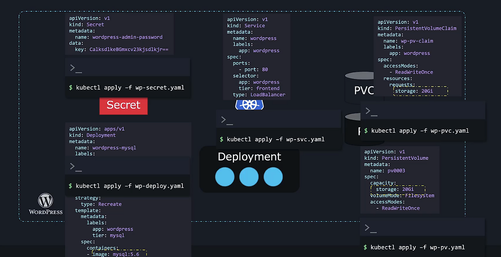

# Helm Basics



## What is Helm

### 기존 쿠버네티스 관리의 문제점

1. **복잡성** - 하나의 애플리케이션이 여러 오브젝트로 구성됨
    - 배포(Deployment)
    - 영구 볼륨(Persistent Volume)
    - 영구 볼륨 클레임(PVC)
    - 서비스(Service)
    - 시크릿(Secret)
2. **관리의 어려움**
    - 각 오브젝트마다 별도 YAML 파일 필요
    - 각 파일에 `kubectl apply` 반복 실행 필요
    - 설정 변경 시 여러 파일 수정 필요
    - 업그레이드 복잡
    - 삭제 시 모든 오브젝트 개별 삭제 필요

### 해결책 (Helm)

- **패키지 개념 도입**
    - 여러 쿠버네티스 오브젝트를 하나의 패키지로 관리
    - 게임 설치 프로그램과 유사한 개념
- **단일 명령 설치** - 수백 개의 오브젝트도 한 번에 설치
- **간편한 설정 변경** - `values.yaml` 파일에서 모든 설정 관리
- **업그레이드/롤백** - 단일 명령으로 앱 업그레이드 및 이전 버전으로 롤백
- **간편한 삭제** - 앱 관련 모든 오브젝트를 자동으로 식별하고 삭제

## A quick note about Helm2 vs Helm3

### Tiller 제거

- **Helm 2**:
    - Tiller라는 중간 구성 요소가 필요했음
    - 클라이언트 → Tiller → 쿠버네티스 구조
    - 보안 문제: Tiller이 "God mode"로 실행 (모든 권한 보유)
    - 복잡성 증가
- **Helm 3**:
    - Tiller 완전 제거
    - 클라이언트가 직접 쿠버네티스와 통신
    - 쿠버네티스의 RBAC(Role-Based Access Control) 활용
    - 보안 강화: 사용자 권한이 kubectl이나 Helm 어떤 도구를 사용하든 동일하게 적용됨


### Three-way Strategic Merge Patch

- **Helm 2**:
    - 현재 차트와 이전 차트만 비교
    - 수동 변경 감지 불가
    - 롤백 시 차트 간 차이만 고려
- **Helm 3**:
    - 3가지 상태 비교:
        1. 현재 사용 중인 차트
        2. 되돌리려는 차트
        3. 실제 라이브 상태
    - 수동으로 변경된 내용도 감지 가능
    - 롤백 시 라이브 상태의 차이도 고려

## Helm Components


- **Helm CLI**: 로컬 시스템에서 차트 설치, 업그레이드, 롤백 등 수행
- **Charts**: 쿠버네티스 클러스터에 필요한 객체 생성 지침이 담긴 파일 모음
- **Release**: 차트를 사용한 애플리케이션의 단일 설치 인스턴스
- **Revision**: 애플리케이션 스냅샷으로, 변경 발생시마다 새로운 리비전 생성
- **Repository**: 공개 차트를 다운로드할 수 있는 곳
- **Metadata**: Helm이 쿠버네티스 시크릿으로 저장하는 릴리스, 차트, 리비전 정보

## Helm charts

- 헬름이 작업을 수행하는 데 필요한 **지시 매뉴얼** 역할
- 사용자 관점에서는 특정 방식으로 이름 지어진 텍스트 파일들의 모음임
    - **values.yaml**: 차트에 전달할 설정 파라미터 포함
    - **chart.yaml**: 차트 자체에 대한 정보 포함
    - **templates Directory**: 쿠버네티스 매니페스트 템플릿 파일 포함
    - **LICENSE**: 라이센스 정보 (선택사항)
    - **README.md**: 차트 사용법 (선택사항)
    - **charts/**: 의존성 차트들 (선택사항)

### chart.yaml

- **apiVersion**: V1(헬름 2용) 또는 V2(헬름 3용)
- **appVersion**: 배포할 애플리케이션 버전(WordPress 등)
- **version**: 차트 자체의 버전
- **name**: 차트 이름
- **description**: 차트 설명
- **type**: application(기본) 또는 library
- **dependencies**: 차트가 의존하는 다른 차트
- **keywords**: 차트 검색에 도움이 되는 키워드
- **maintainers**: 유지보수자 정보
- **home/icon**: 프로젝트 홈페이지/아이콘 URL (선택사항)

## Working with Helm: basics

- 명령어
    - `helm repo add` - 차트 저장소 추가
    - `helm repo list` - 저장소 목록 확인
    - `helm repo update` - 저장소 정보 최신화
    - `helm search hub [키워드]` - ArtifactHub에서 검색
    - `helm search repo [키워드]` - 추가된 저장소에서 검색
    - `helm install my-release bitnami/wordpress`
    - `helm uninstall [릴리스명]`
    - `helm rollback [릴리스명] [버전]`
- **ArtifactHub 웹사이트 사용**:
    - artifacthub.io에서 차트 검색
    - 공식 또는 검증된 게시자 배지가 있는 차트 선택 권장
    - 차트 페이지에서 설치 명령어와 설정 정보 확인 가능

## Customizing chart parameters

1. `—-set`  

```java
helm install wordpress-site bitnami/wordpress \
  --set wordpressBlogName="Helm Tutorials" \
  --set wordpressEmail="john@example.com"
```

1. 사용자 정의 values file
    
    `helm install wordpress-site bitnami/wordpress --values customvalues.yaml`
    
2. 기본 values 파일 수정
    1. 차트 다운로드: `helm pull bitnami/wordpress --untar`
    2. `wordpress/values.yaml` 파일 직접 수정
    3. 로컬 디렉토리에서 설치: `helm install wordpress-site ./wordpress`

## Lifecycle management with Helm

- **Release**: 차트를 설치할 때마다 생성되는 쿠버네티스 오브젝트의 모음
- **Lifecycle Management**: Release의 현재 상태, 이전 상태, 미래 상태를 추적하고 관리하는 과정
- **Revision** : Helm에서 릴리스의 버전 또는 상태를 나타내는 번호
    - 해당 시점의 **차트 버전** (Chart Version)
    - 해당 시점의 **앱 버전** (App Version)
    - 모든 **쿠버네티스 매니페스트 파일**의 상태
    - 수행된 **작업 유형** (설치, 업그레이드, 롤백)
1. Release 설치
    
    `helm install [릴리스명] [차트명] --version [버전]`
    
2. Release 업그레이드
    
    `helm upgrade [릴리스명] [차트명]`
    
    - 모든 관련 쿠버네티스 오브젝트를 한 번에 업그레이드
    - 새 Revision 생성됨
3. Release 롤백
    
    `helm rollback [릴리스명] [리비전번호]`
    
    - 이전 상태로 되돌릴 수 있음
    - 롤백 시 새로운 Revision이 생성됨 (이전 Revision의 구성과 동일)
4. Release 정보 확인
    - `helm list` : Release 목록 확인
    - `helm history` : Release 히스토리 확인