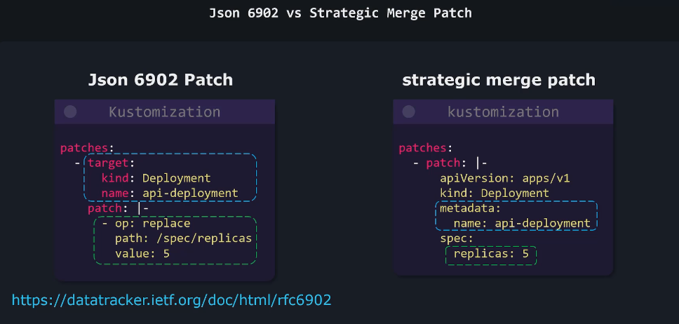

# Kustomize Basics

## Kustomize Problem Statement & idealogy

- 문제 상황

> 다양한 환경(개발, 스테이징, 프로덕션)에서 **쿠버네티스 설정을 커스터마이즈** 해야 함
간단한 예: `nginx` 배포 파일에서 환경별로 다른 `replicas` 수 설정 필요
  - 개발 환경: 1개 (로컬 머신)
  - 스테이징 환경: 2-3개
  - 프로덕션 환경: 5-10개
> 
- 단순한 해결책과 문제점
    - **환경별로 별도 디렉토리 생성** (dev, staging, production)
    - 각 폴더에 동일한 설정 파일 복제 후 필요한 값만 수정
    - 문제점:
        - 확장성 부족
        - 파일 중복으로 유지보수 어려움
        - 변경 사항 발생 시 모든 환경에 적용해야 함
        - 설정 불일치 가능성 높음

### Kustomize

- **중복 없이 환경별 커스터마이징**을 위해 만들어짐
- 두 가지 핵심 개념:
    1. **Base 설정**: 모든 환경에 동일하게 적용되는 기본 설정
    2. **Overlays**: 환경별 차이점만 정의하는 설정
- 폴더 구조

```
├── base/           # 기본 설정 파일들
└── overlays/
    ├── dev/        # 개발환경 오버레이
    ├── staging/    # 스테이징 오버레이
    └── production/ # 프로덕션 오버레이
```

- Kustomize 장점
    - kubectl에 기본 내장됨 (별도 설치 불필요)
    - 템플릿 시스템 없이 표준 YAML 사용
    - 단순성 유지
    - 읽기 쉬운 구조

### (+) 환경 변수의 한계

- **구조적 설정 변경에 부적합**:
    - 환경변수는 단순 값만 바꿀 수 있음
    - 배열이나 중첩된 객체 등 복잡한 구조 수정 어려움
    - 예: 전체 포드 스펙 또는 볼륨 마운트 설정 변경
- **리소스 추가/제거 불가**:
    - 환경별로 완전히 다른 리소스가 필요할 때 처리 불가
    - 프로덕션에만 필요한 HPA(수평적 파드 오토스케일러)
    - 개발 환경에만 필요한 디버깅 도구
- **복잡한 매니페스트 처리**:
    - 대규모 쿠버네티스 배포에선 수십~수백 개 설정 필요
    - 모든 값을 환경변수로 관리하면 복잡도 증가
- **중앙 관리 어려움**:
    - 많은 환경변수 = 큰 관리 부담
    - 여러 서비스에 같은 환경변수 중복 설정 필요
- **버전 관리 문제**:
    - 환경변수는 코드와 분리되어 버전 관리 어려움
    - 설정 변경 이력 추적 불편

## Kustomize vs Helm

- Helm
    - Go 템플릿 문법을 사용하여 다양한 속성에 변수 할당
        - 예: `{{ .replicaCount }}` 같은 변수 문법 사용
    - 변수는 `values.yaml` 파일에서 값을 가져옴
    
    ```yaml
    replicaCount: 1
    image:
      tag: 2.4.4
    ```
    
    - `templates/` 디렉토리: Go 템플릿 문법이 적용된 쿠버네티스 매니페스트 파일들
    - `environment/` 디렉토리: 환경별 values 파일 보관
        - `values.dev.yaml`
        - `values.staging.yaml`
        - `values.prod.yaml`
- Kustomize
    - 단순하고 읽기 쉬움
    - 기능은 많지만 복잡함

## kustomization.yaml file

- Resources Section
    - Kustomize가 관리할 모든 쿠버네티스 리소스 목록을 포함함
    - 예시: nginx deployment, nginx service YAML 파일 등 나열
- Transformations Section
    - 적용하고 싶은 모든 커스텀 및 변환을 정의
    - 예시: 모든 리소스에 `company: KodeKloud`라는 공통 레이블 추가

### 사용 과정

1. kustomization.yaml 파일 생성 및 설정
2. `kustomize build` 명령어 실행
    
    예: `kustomize build k8s/` (k8s는 kustomization.yaml 파일이 있는 디렉토리)
    
3. 명령어 실행 결과로 최종 구성이 터미널에 출력됨
    - nginx service와 deployment 정의가 표시됨
    - 모든 리소스에 `company: KodeKloud` 레이블이 적용된 것을 확인할 수 있음

> 실제 적용까지 하려면 kubectl apply 까지 사용해야함.
> 

## Kustomize Output

- 적용 방법
    1. `kustomize build k8s | kubectl apply -f -`
    2. `kubectl apply -k [kustomization.yaml 존재하는 디렉토리]`
- 삭제 방법
    1. `kustomize build k8s | kubectl delete -f -`
    2. kubectl delete -k `[kustomization.yaml 존재하는 디렉토리]`

## Managing Directories

1. root에 `kustomization.yaml` 1개만 두고 사용
2. root에 `kustomization.yaml` + 각 하위 디렉토리에 `kustomization.yaml` 추가
    1. root 의 `kustomization.yaml` 를 깔끔하게 유지 가능
    2. gradle 설정이나 Makefile 하는 거랑 똑같은 듯

## Managing Directories Demo

- Before
    
    ```bash
    kubectl apply -f k8s/api
    kubectl apply -f k8s/cache
    kubectl apply -f k8s/db
    ```
    
- After
    
    ```bash
    apiVersion: kustomize.config.k8s.io/v1beta1
    kind: Kustomization
    resources:
      - api/api-depl.yaml
      - api/api-service.yaml
      - cache/redis-config.yaml
      - cache/redis-depl.yaml
      - cache/redis-service.yaml
      - db/mongo-depl.yaml
      - db/mongo-service.yaml
    ```
    
    1. `kustomize build k8s | kubectl apply -f -`
    2. `kubectl apply -k k8s`

## Common Transformers

- **commonLabel**: 모든 Kubernetes 리소스에 공통 레이블 추가
- **namePrefix/Suffix**: 리소스 이름에 접두사/접미사 추가
- **Namespace**: 모든 리소스를 특정 네임스페이스로 이동
- **commonAnnotations**: 모든 리소스에 공통 어노테이션 추가
- 사용 예시
    - commonLabel 적용
    
    ```yaml
    commonLabels:
      org: KodeKloud
    ```
    
    - Namespace 적용
    
    ```yaml
    namespace: my-namespace
    ```
    
    - 이름 접두사/접미사 적용
    
    ```yaml
    namePrefix: prefix-
    nameSuffix: -dev
    ```
    
    - 공통 어노테이션 적용
    
    ```yaml
    commonAnnotations:
      managed-by: kustomize
    ```
    

## Image Transformers

`kustomization.yaml`

```bash
images:
  - name: nginx
    newName: haproxy
	  newTag: 2.4
```

## Patches Intro

- Pacthes (surgical approach to targeting one or more)
    - Operation Type (add/remove/replace)
    - Target (Kind, Version/Group, Name, NameSpace, labelSelector, AnnotationSelector)
    - Value (delete 필요X)

```bash
patches:
  - target:
      kind: Deployment
      name: api-deployment
    patch: |-
      - op: replace
	      path: /metadata/name
	      value: web-deployment
```

> Operation: move, copy, test 등도 있음
> 



- JSON 6902 패치
    - 인라인 방식 또는 별도 파일 방식 모두 가능
    - 대규모 패치나 복잡한 패치의 경우 별도 파일 추천
- 전략적 병합 패치 (Strategic Merge Patch)
    - 기존 레이블과 함께 병합
    - delete: 삭제 시 해당 키의 값을 null로 지정

## Different Types of Patches


1. 인라인 패치 (Inline Patch)
    1. `kustomization.yaml` 파일 내부에 직접 패치 내용을 정의
    2. 간단한 패치의 경우 선호되는 방식
    3. 패치 내용을 바로 확인할 수 있음
2. 별도 파일 패치 (Separate File Patch)
    1. 패치 내용을 별도의 YAML 파일(예: `replica-patch.yaml`)에 정의
    2. `kustomization.yaml`에서는 패치 파일의 경로만 지정
    3. 패치가 많아져 `kustomization.yaml`이 복잡해질 때 유용
    4. 코드 가독성과 관리성 향상

## Patches Dictionary

- JSON 6902 패치 방식
    - 경로구분 `/`
    - replace: 패치 파일에서 정확한 경로와 새 값을 지정
    - delete: 삭제할 키 지정
- 전략적 병합 패치 방식
    - 원본 구성에서 변경할 부분만 복사
    - 대상 오브젝트의 이름과 변경할 속성만 포함
    - add: 패치 파일에 새 레이블 직접 추가
    - delete: 삭제할 키의 값을 null로 설정

## Patches list

- 교체
    - Json6902 패치: 인덱스를 사용해 특정 요소 교체
    - 전략적 병합 패치(Strategic Merge Patch): 이름을 기반으로 요소 교체
- 추가
    - **Json6902 패치**:
        - 작업을 `add`로 설정
        - 경로 끝에 `-` 사용 (리스트 마지막에 추가)
        - 특정 인덱스 지정 가능 (0부터 시작)
    - **전략적 병합 패치**:
        - Kustomize가 자동으로 리스트에 병합
- 삭제
    - **Json6902 패치**:
        - 작업을 `remove`로 설정
        - 삭제할 요소의 인덱스 지정
        - 인덱스는 0부터 시작 (첫 번째 요소 = 0)
    - **전략적 병합 패치**:
        - `$patch: delete` 지시어 사용
        - 삭제할 요소의 세부 정보 제공

## Overlays


### base/nginx-deployment.yaml

```yaml
apiVersion: apps/v1
kind: Deployment
metadata:
  name: nginx-deployment
spec:
  replicas: 1
  selector:
    matchLabels:
      app: nginx
  template:
    metadata:
      labels:
        app: nginx
    spec:
      containers:
      - name: nginx
        image: nginx:1.14.2
        ports:
        - containerPort: 80
```

### base/kustomization.yaml

```yaml
apiVersion: kustomize.config.k8s.io/v1beta1
kind: Kustomization
resources:
- nginx-deployment.yaml
```

### overlays/dev/kustomization.yaml

```yaml
apiVersion: kustomize.config.k8s.io/v1beta1
kind: Kustomization
bases:
- ../../base
patches:
- nginx-patch.yaml
```

### overlays/dev/nginx-patch.yaml

```yaml
apiVersion: apps/v1
kind: Deployment
metadata:
  name: nginx-deployment
spec:
  replicas: 2
```

### overlays/production/kustomization.yaml

```yaml
apiVersion: kustomize.config.k8s.io/v1beta1
kind: Kustomization
bases:
- ../../base
patches:
- nginx-patch.yaml
resources:
- grafana-deployment.yaml
```

### overlays/production/nginx-patch.yaml

```yaml
apiVersion: apps/v1
kind: Deployment
metadata:
  name: nginx-deployment
spec:
  replicas: 3
```

### overlays/production/grafana-deployment.yaml

```yaml
apiVersion: apps/v1
kind: Deployment
metadata:
  name: grafana-deployment
spec:
  replicas: 1
  selector:
    matchLabels:
      app: grafana
  template:
    metadata:
      labels:
        app: grafana
    spec:
      containers:
      - name: grafana
        image: grafana/grafana:latest
        ports:
        - containerPort: 3000
```

```bash
kubectl kustomize k8s/overlays/dev | kubectl apply -f -

kubectl kustomize k8s/overlays/production | kubectl apply -f -
```

## Components

- **재사용 가능한 설정 로직의 블록**
    - 여러 오버레이에서 선택적으로 사용 가능
    - 코드 중복을 방지
    - 특정 기능과 관련된 모든 쿠버네티스 리소스를 포함

프로젝트 폴더 구조:

```
project/
├── base/
├── overlays/
│   ├── dev/
│   ├── premium/
│   └── self-hosted/
└── components/
    ├── caching/
    └── database/
```

- 컴포넌트 리소스 파일


- 컴포넌트 정의 파일


- 컴포넌트 패치 파일


- 오버레이에서 컴포넌트 사용


### 컴포넌트 적용 방법

1. 컴포넌트 폴더에 필요한 리소스 정의
2. `kustomization.yaml`의 종류를 `Component`로 변경
3. 오버레이의 `kustomization.yaml`에서 컴포넌트 import